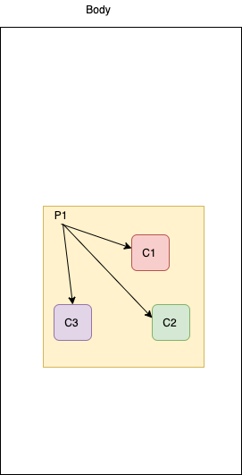
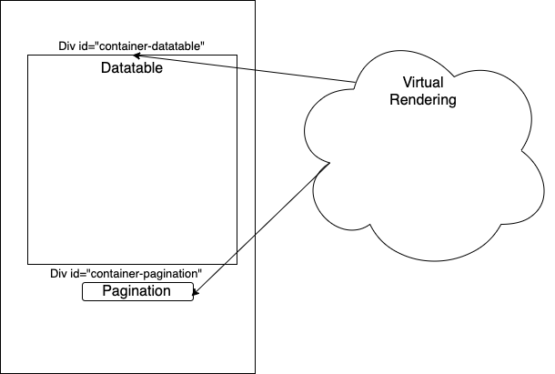

Hogosuru [](https://github.com/realPy/hogosuru/actions/workflows/ci.yml)
=========

Hogosuru is a framework to easily write a complete single page application in Go or just export some functionnality directly accessible in javascript (functionnality that need speed for example).  

## How it work?
He use an addon syscall/js (that catch error) and implement a large part of the major features of javascript directly accessible in go.  

For a list of functionnality , see the array of compatibility below or check the name of directory that match the API MDN implementation: https://developer.mozilla.org/fr/docs/Web/API  
   
Each object is herited from a baseobject.BaseObject. The baseobject keep a true JS object reference.  
   
All structure available can interact with this object and use the internal functionnality  of each object.  
If an error occur , this error is handle and return by each function.  
   
## How to use

Just import the lib in your project (hogosuru no need use an extended rewrite of base syscall)

```

GOOS=js GOARCH=wasm go get github.com/realPy/hogosuru
```
The project work with Go and Tinygo compiler.
Use Go compiler for developpement (faster) and tinygo for production

## Prepare your environment

When your compile your project you must provide the wasm_exec.js corresponding with your current compiler.
If you upgrade your compiler dont forget to copy the new wasm_exec.js that target your compiler.

### Live testing thanks to wasmbrowsertest


You can live testing your code thanks to https://github.com/agnivade/wasmbrowsertest  

Follow the quick start guide https://github.com/agnivade/wasmbrowsertest#quickstart   

and go run your project or some example

```
WASM_HEADLESS=off GOOS=js GOARCH=wasm  go run example/hello/main.go
```

The hello world is open on your browser

### building with tinygo

Start the tinygo container with your source  
```
docker run --rm -it -w /go/src/hogosuru -v "$PWD":/go/src/hogosuru tinygo/tinygo bash 
```

If you the compiler is upgraded, Sync the wasm_exec.js loader with your current wasm_exec.js compiler version

```
cp /usr/local/tinygo/targets/wasm_exec.js /go/src/hogosuru/example/static/
```

Optional: If you want compile all example you need make:  

```
apt-get update
apt-get install make
```

### building with Go

Just 

```
GOOS=js GOARCH=wasm go build -o ./example/static/hello.wasm  example/hello/main.go
```

dont forget to always include the wasm_exec.js from your go compiler
```
cp $(go env GOROOT)/misc/wasm/wasm_exec.js example/static/
```

## How to load the wasm product with a web application

The best reference to understand how to load web assembly is the MDN https://developer.mozilla.org/fr/docs/WebAssembly  

In resume you need include the wasm_exec.js and some JS code to fetch your wasm and execute it.

```
       <script src="wasm_exec.js"></script>
        <script>


const wasmBrowserInstantiate = async (wasmModuleUrl, importObject) => {
  let response = undefined;

  // Check if the browser supports streaming instantiation
  if (WebAssembly.instantiateStreaming) {
    // Fetch the module, and instantiate it as it is downloading
    response = await WebAssembly.instantiateStreaming(
      fetch(wasmModuleUrl),
      importObject
    );
  } else {
    // Fallback to using fetch to download the entire module
    // And then instantiate the module
    const fetchAndInstantiateTask = async () => {
      const wasmArrayBuffer = await fetch(wasmModuleUrl).then(response =>
        response.arrayBuffer()
      );
      return WebAssembly.instantiate(wasmArrayBuffer, importObject);
    };

    response = await fetchAndInstantiateTask();
  }

  return response;
};

const go = new Go();
const runWasmAdd = async () => {
  // Get the importObject from the go instance.
  const importObject = go.importObject;

  // Instantiate our wasm module
  const wasmModule = await wasmBrowserInstantiate("example.wasm", importObject);

  // Allow the wasm_exec go instance, bootstrap and execute our wasm module
  go.run(wasmModule.instance);

};
runWasmAdd();

        </script>
```
Just replace the "example.wasm" with the relative (or absolute) link of you binary wasm


## Why there is so many directory in hogosuru ?

Hogosuru is splitted in several directory for each components for a specific reason:  
Avoid the inclusion of binary code that would not be necessary and thus avoid loading the entire framework (and especially having the smallest binaries possible)  
Apart from the dependence of the components between them, tinygo will include the strict necessary for the compilation of your project

## Minimal code for your wasm

Your main MUST always include a waiting channel a the end of the main.    
If your not include this channel, the wasm just load, exec and stopped.  
If you web app export some function, handle event , all this functional code is unloaded and can't be used.  

```
package main


func main() {
    
	ch := make(chan struct{})
	<-ch

}
```

## Compile and test you first example hello world

Below we create a tiny hello world with dom manipulating  
We need first a minimal html file that load our wasm with no content just and empty body (see /example/hello.html)
Dont forget to init the lib thanks to 
```
hogosuru.Init()
```

We want to create a h1 element with a text "Hello world"  


```
package main

import (
	"github.com/realPy/hogosuru"
	"github.com/realPy/hogosuru/document"
	"github.com/realPy/hogosuru/htmlheadingelement"
)

func main() {
    hogosuru.Init()    
	//we get the current document if an error occur the err is draw to the console thank to AssertErr
	if doc, err := document.New(); hogosuru.AssertErr(err) {

		//we get the body of the document if an error occur the err is draw to the console thank to AssertErr
		if body, err := doc.Body(); hogosuru.AssertErr(err) {

			//now we create dynamiclly the h1 element
			if h1, err := htmlheadingelement.NewH1(doc); hogosuru.AssertErr(err) {

				//We set the text content with Hello World
				h1.SetTextContent("Hello world")
				// and append to the body

				body.AppendChild(h1.Node)

			}

		}
	}
	
	ch := make(chan struct{})
	<-ch

}
```

We compile our first wasm hello world  (inside the container) with :
```
tinygo build  -o ./example/static/hello.wasm --no-debug -target wasm example/hello/main.go
```

And voila the hello.wasm is build :)  

Now you want see the result in your favorite browser!  

First we need to serve the wasm and html files with an HTTP Server . Thanks to go , it's easy to build 
an http server with few lines of code (example/server/main.go) (PS: you can use nginx, caddy or other server http to serve it)
This server must not be run inside the tinygo container. Just start it with your local machine

```
go run example/server/main.go
```

It's serve all static files on 9090 port (you can change it)

Just open http://localhost:9090/hello.html and see result   

You can now build your web page with all HTML5 components available (see hogosuru source , components wil begin with html prefix)  
To understand all html function and attribute , go to MDN reference: https://developer.mozilla.org/fr/docs/Web/API

## How to export object and use it in javascript

All object herit from BaseObject. You can export a JS object with the method **Export**

In the example below we create a new date from timestamp and export to JS "myexporteddate 

```
timestamp, _ := date.UTC(2012, 11, 20, 3, 0, 0)

if d2, err := date.New(timestamp); hogosuru.AssertErr(err) {
	d2.Export("myexporteddate")
}
```

If you open a console developer in in your browser, you can type "myexporteddate" and use the variable in pure JS code.  

Export can also be used when you want debugging some symbol  


## How to export function and use it in javascript

Function can also be exported easily.
An hogosuru will be implemented in the future.

```
func TestFunc() js.Func {
	return js.FuncOf(func(this js.Value, args []js.Value) interface{} {

        return nil 
    }
}
js.Global().Set("test", TestFunc())
```

## Can i use hogosuru and javascript together?

YES, Webassembly was specially created for this use. The export variable and function can be helped for this use.

## Lets see together some simple example

Lots of example can be found in the /example/ directory.  
All example is simple and show you how to use some complex components.


# How to implement a single page application with hogosuru routing capabilities

Hogosuru is not just a "glue JS Framework". I want to give the possibility to gophers to implemented Back and Front with the 
same language. I want to create an alternative to angular/react write in go.

All this capabilities will be publish on the "hogosuru" namespace.  

## The router)


There are 2 sort of routing in single page application  
The url hashes : routing is used after the # in the url. This routing can confuse the true utility of # (hash). This can be used when we dont have the possibility to configure properly the server.

The traditionnal routing: All routing is redirected to the same page. This requires setting up the server correctly and therefore having access to the server configuration

You can choice the router when you use the Start method of the router we the value:
 * hogosuru.STDROUTE
 * hogosuru.HASHROUTE

### Register components
We must register a struct for each routing we want to handle.  
The struct must implement interface 

```
type Rendering interface {
	OnLoad(d document.Document, n node.Node, route string) (*promise.Promise, []Rendering)
	OnEndChildsRendering()
	OnEndChildRendering(r Rendering)
	Node(r Rendering) node.Node
	OnUnload()
}
```

OnLoad is call when the route is called for each components and childs components


 * d : The current document is given in parameter to create dynamic components  
 * n : is the current node given node by parents and suggest to be attached for this renderer
 * route: is the current route called

Return :  
*  *promise.Promise: Pointer to a promise Struct that ca be empty (promise.Promise{}), nil or a true promise. If the components will not wait children to be rendering. If not null, the current promise and childrens will wait before call OnEndChildRendering


Note: Thanks to this return , you sync loading a drawing elements;

* []Rendering: The childrens renderings (that vbe contained childrens etc..)


	Node(r Rendering) node.Node: Is called from children to parents to get the node that will be given to OnLoad methods.


OnEndChildRendering(r Rendering) : Is called for for each children when rendering is ready but always before OnEndChildsRendering()

OnUnload(): Is called from router when the route change and must detach (or destruct/reset) elements 

### Arts of struct and Syncing

With the rendering interface you can easly sync all your components and place anywhere in your body

You can use the suggested node given by parents and attached if after rendering or get the node on the parent points of view and attached in dedicated place on your body (thanks to getElementById or other method).


A simple example with a node container (div) with three other components inside it:




Sequence of rendering

 * P1: Will be executed the P1 promise, and return 3 rendering (C1,C2,C3)
the Promise P1 will be processed in parallels of loading C1,C2,C3
* C1 will be load and ask parents the node parents to attach and porpurse to the loading method of C1(Node method)
* C1 finished to renderings (and have no child), OnEndChildRendering of parents is called
OnEndChildsRendering is called on C1 and can be attached to parents
* C2,C3 will be proceed in the same way
OnEndChildsRendering is called on P1  when P1, C1,C2,C3 is finished of loading
* P1 can be attached to body with C1,C2,C3  sync


A more complex and common example:  

M1 is for example the left bar menu and top menu and will be loaded as soon as possible
P1 wil contain C1,C2,C3 and will be show only when C1,C2,C3 is loaded as the same time.
P1 dosn't contain a loading so it will be just return an empty Promise.


* M1 OnLoaded will return nil and P1 rendering
* P1 Onloaded wil return an empty promise (no operation todo but want wait childrens) and C1,C2,C3


Another use can be as a virtual Rendering. Rendering can be see as a cooordinator of the childs elements.
The virtual rendering can set all childs nodes thanks to Node(), and select a div contains in the body (thanks to getElementByID).
The childs will be attached to this elements. The coordinator never allocate a node.




You can check hogousuru components to see example of use of rendering.


### Example (/example/routing/main.go)
This example below show you how to build a single page application and can be found in the example directory

```
func main() {
    hogosuru.Init()//install syscall (tinygo dont implement init on package )
	hogosuru.Router().DefaultRendering(&view.GlobalContainer{})
	hogosuru.Router().Add("/app/", &view.WebMain{})
	hogosuru.Router().Add("/app/hello", &view.HelloView{})
	hogosuru.Router().Start(hogosuru.STDROUTE)
	ch := make(chan struct{})
	<-ch

}
```

## Assert Error

AssertError is special helpers to show the current error in the console application  

It is use in replacement of the 

```
if obj,err:= mmyfunction();err==nil {

}else {
    println("Error": + err.Error())
}
```

by 

```
if obj,err:= myfunction();hogosuru.AssertError(err) {

}
```

## Use the special "autodiscover" of hogosuru

The autodiscover is a special function. 

When a function receives a data which is global object (exemple with the attribute data of an event) or which is not an expected data, it is possible to ask hogosuru to guess the content of the object and to create the corresponding Go object.

This is not magic, and it only works if the type of object has already been seen before (hogosuru keeps in memory the type of objects and their constructor).  
It would be possible to register all the objects known to hogosuru but that would amount to integrating the whole implementation in your binary.   
Instead, you will have to anticipate and load the component once using the GetInterface () function or using an object of this type.
If the type is not known, autodiscover will return an object of type BaseObject


## Chaining capabilities

Some structure like nodelist or document can be used with chaining capabilities (function that return one object that will be used immediatly without check error).It's a shortcut that ignores errors.
The functions which allow this functionality are by convention with the same prototype, with the same name but which end with "_". It is a convention created for hogosuru. All the functions available in chaining are contained in the "chaining.go" file at the root of each component


## How to help

This is a young project and there are a lot of work to do  
All help is welcome. If you are interested by this project, please contact me


## Implemented API/Object status 

    

|  API/Object |  Implemented Support |  MDN URL |
|-------------|:--------------------:|----------|
| AbortController | Full | https://developer.mozilla.org/en-US/docs/Web/API/AbortController | 
| AbortSignal | Full | https://developer.mozilla.org/en-US/docs/Web/API/AbortSignal | 
| AnimationEvent | Full | https://developer.mozilla.org/fr/docs/Web/API/AnimationEvent | 
| Array | Full | https://developer.mozilla.org/fr/docs/Web/JavaScript/Reference/Global_Objects/Array | 
| Arraybuffer |  Full | https://developer.mozilla.org/fr/docs/Web/JavaScript/Reference/Global_Objects/ArrayBuffer | 
| Attr | Full | https://developer.mozilla.org/fr/docs/Web/API/Attr |
| Blob | Full |  https://developer.mozilla.org/fr/docs/Web/API/Blob |
| Broadcast Channel |  Full |  https://developer.mozilla.org/en-US/docs/Web/API/BroadcastChannel  | 
| Console |  Full |  https://developer.mozilla.org/fr/docs/Web/API/Console  | 
| CSSRule |  Full |  https://developer.mozilla.org/en-US/docs/Web/API/CSSRule | 
| CSSStyleDeclaration |  Full |  https://developer.mozilla.org/en-US/docs/Web/API/CSSStyleDeclaration | 
| CustomEvent |  Full |  https://developer.mozilla.org/fr/docs/Web/API/CustomEvent |
| DataTransfer | Full | https://developer.mozilla.org/en-US/docs/Web/API/DataTransfer |
| DataTransferItem | Partial | https://developer.mozilla.org/en-US/docs/Web/API/DataTransferItem |
| DataTransferItemList | Full | https://developer.mozilla.org/en-US/docs/Web/API/DataTransferItemList |
| Date| Full | https://developer.mozilla.org/fr/docs/Web/JavaScript/Reference/Global_Objects/Date | 
| Document | Mostly  | https://developer.mozilla.org/fr/docs/Web/API/Document | 
| DragEvent |  Full |  https://developer.mozilla.org/en-US/docs/Web/API/DragEvent |
| Element | Full | https://developer.mozilla.org/fr/docs/Web/API/Element | 
| Event | Partial implemented | https://developer.mozilla.org/fr/docs/Web/API/Event |
| EventTarget | Full | https://developer.mozilla.org/fr/docs/Web/API/EventTarget/EventTarget | 
| Fetch | Full | https://developer.mozilla.org/fr/docs/Web/API/Fetch_API |
| File | Full | https://developer.mozilla.org/fr/docs/Web/API/File |
| FileList | Full | https://developer.mozilla.org/fr/docs/Web/API/FileList |
| FormData | Partial implemented | https://developer.mozilla.org/fr/docs/Web/API/FormData |
| Headers | Full | https://developer.mozilla.org/en-US/docs/Web/API/Headers |
| History | Full | https://developer.mozilla.org/fr/docs/Web/API/History |
| HTMLAnchorElement| Full| https://developer.mozilla.org/en-US/docs/Web/API/HTMLAnchorElement|
| HTMLAreaElement| Full| https://developer.mozilla.org/en-US/docs/Web/API/HTMLAreaElement|
| HTMLBaseElement| Full| https://developer.mozilla.org/en-US/docs/Web/API/HTMLBaseElement|
| HTMLBodyElement| Full| https://developer.mozilla.org/en-US/docs/Web/API/HTMLBodyElement|
| HTMLBRElement| Full| https://developer.mozilla.org/en-US/docs/Web/API/HTMLBRElement|
| HTMLButtonElement| Full| https://developer.mozilla.org/en-US/docs/Web/API/HTMLButtonElement|
| HTMLCollection| Full | https://developer.mozilla.org/fr/docs/Web/API/HTMLCollection |
| HTMLDataElement| Full| https://developer.mozilla.org/en-US/docs/Web/API/HTMLDataElement|
| HTMLDataListElement| Full| https://developer.mozilla.org/en-US/docs/Web/API/HTMLDataListElement|
| HTMLDetailsElement| Full| https://developer.mozilla.org/en-US/docs/Web/API/HTMLDetailsElement|
| HTMLDivElement| Full| https://developer.mozilla.org/en-US/docs/Web/API/HTMLDivElement|
| HTMLDListElement| Full| https://developer.mozilla.org/en-US/docs/Web/API/HTMLDListElement|
| HTMLElement| Full| https://developer.mozilla.org/en-US/docs/Web/API/HTMLElement|
| HTMLEmbbedElement| Full| https://developer.mozilla.org/en-US/docs/Web/API/HTMLEmbbedElement|
| HTMLFieldSetElement| Full| https://developer.mozilla.org/en-US/docs/Web/API/HTMLFieldSetElement|
| HTMLFormElement| Full| https://developer.mozilla.org/en-US/docs/Web/API/HTMLFormElement|
| HTMLHeadElement| Full| https://developer.mozilla.org/en-US/docs/Web/API/HTMLHeadElement|
| HTMLHeadingElement| Full| https://developer.mozilla.org/en-US/docs/Web/API/HTMLHeadingElement|
| HTMLHRElement| Full| https://developer.mozilla.org/en-US/docs/Web/API/HTMLHRElement|
| HTMLIFrameElement| Full| https://developer.mozilla.org/en-US/docs/Web/API/HTMLIFrameElement|
| HTMLImageElement| Full| https://developer.mozilla.org/en-US/docs/Web/API/HTMLImageElement|
| HTMLInputElement| Full| https://developer.mozilla.org/fr/docs/Web/API/HTMLInputElement |
| HTMLLabelElement| Full| https://developer.mozilla.org/en-US/docs/Web/API/HTMLLabelElement|
| HTMLLegendElement| Full| https://developer.mozilla.org/en-US/docs/Web/API/HTMLLegendElement|
| HTMLLIElement| Full| https://developer.mozilla.org/en-US/docs/Web/API/HTMLLIElement|
| HTMLLinkElement| Full| https://developer.mozilla.org/en-US/docs/Web/API/HTMLLinkElement|
| HTMLMapElement| Full| https://developer.mozilla.org/en-US/docs/Web/API/HTMLMapElement|
| HTMLMetaElement| Full| https://developer.mozilla.org/en-US/docs/Web/API/HTMLMetaElement|
| HTMLMeterElement| Full| https://developer.mozilla.org/en-US/docs/Web/API/HTMLMeterElement|
| HTMLIFrameElement| Full| https://developer.mozilla.org/en-US/docs/Web/API/HTMLIFrameElement|
| HTMLOptionsCollection| Full| https://developer.mozilla.org/en-US/docs/Web/API/HTMLOptionsCollection|
| HTMLParagraphElement| Full| https://developer.mozilla.org/en-US/docs/Web/API/HTMLParagraphElement|
| HTMLQuoteElement| Full| https://developer.mozilla.org/en-US/docs/Web/API/HTMLQuoteElement|
| HTMLScriptElement| Full| https://developer.mozilla.org/en-US/docs/Web/API/HTMLScriptElement|
| HTMLSelectElement| Full| https://developer.mozilla.org/en-US/docs/Web/API/HTMLSelectElement|
| HTMLSourceElement| Full| https://developer.mozilla.org/en-US/docs/Web/API/HTMLSourceElement|
| HTMLSpanElement| Full| https://developer.mozilla.org/en-US/docs/Web/API/HTMLSpanElement|
| HTMLStyleElement | Full| https://developer.mozilla.org/en-US/docs/Web/API/HTMLStyleElement |
| HTMLCaptionElement| Full| https://developer.mozilla.org/en-US/docs/Web/API/HTMLCaptionElement|
| HTMLTableCaptionElement| Full| https://developer.mozilla.org/en-US/docs/Web/API/HTMLTableCaptionElement|
| HTMLTableCellElement| Full| https://developer.mozilla.org/en-US/docs/Web/API/HTMLTableCellElement|
| HTMLTableColElement| Full| https://developer.mozilla.org/en-US/docs/Web/API/HTMLTableColElement|
| HTMLTableElement| Full| https://developer.mozilla.org/en-US/docs/Web/API/HTMLTableElement|
| HTMLTableRowElement| Full| https://developer.mozilla.org/en-US/docs/Web/API/HTMLTableRowElement|
| HTMLTableSectionElement| Full| https://developer.mozilla.org/en-US/docs/Web/API/HTMLTableSectionElement|
| HTMLTemplateElement| Full| https://developer.mozilla.org/en-US/docs/Web/API/HTMLTemplateElement|
| HTMLTextAreaElement| Full| https://developer.mozilla.org/en-US/docs/Web/API/HTMLTextAreaElement|
| HTMLTimeElement| Full| https://developer.mozilla.org/en-US/docs/Web/API/HTMLTimeElement|
| HTMLTitleElement| Full| https://developer.mozilla.org/en-US/docs/Web/API/HTMLTitleElement|
| Indexeddb | Full | https://developer.mozilla.org/fr/docs/Web/API/IndexedDB_API |
| Iterator | - | - |
| JSON | Full | https://developer.mozilla.org/fr/docs/Web/JavaScript/Reference/Global_Objects/JSON |
| Location | Full | https://developer.mozilla.org/fr/docs/Web/API/window/location |
| MessageEvent | Full | https://developer.mozilla.org/fr/docs/Web/API/MessageEvent |
| NamedNodeMap | Full | https://developer.mozilla.org/fr/docs/Web/API/NamedNodeMap |
| Node | Full | https://developer.mozilla.org/en-US/docs/Web/API/Node |
| NodeList | Considerated at Full (Partial implemented but no more need )| https://developer.mozilla.org/fr/docs/Web/API/NodeList | 
| Object | Partial| https://developer.mozilla.org/fr/docs/Web/JavaScript/Reference/Global_Objects/Object | 
| Map | Full | https://developer.mozilla.org/fr/docs/Web/JavaScript/Reference/Global_Objects/Map |
| ProgressEvent | Full | https://developer.mozilla.org/en-US/docs/Web/API/ProgressEvent |
| Promise | Full | https://developer.mozilla.org/en-US/docs/Web/JavaScript/Reference/Global_Objects/Promise |
| ReadableStream | Full | https://developer.mozilla.org/en-US/docs/Web/API/ReadableStream |

| Response | Full | https://developer.mozilla.org/fr/docs/Web/API/Response |
| Storage | Full | https://developer.mozilla.org/fr/docs/Mozilla/Add-ons/WebExtensions/API/storage |
| Stream | Partial implemented | https://developer.mozilla.org/fr/docs/Web/API/Streams_API |
| StyleSheet | Full | https://developer.mozilla.org/en-US/docs/Web/API/StyleSheet |
| Uint8array | Partial implemented | https://developer.mozilla.org/fr/docs/Web/JavaScript/Reference/Global_Objects/Uint8Array |
| ValidityState | Full | https://developer.mozilla.org/en-US/docs/Web/API/ValidityState |
| WebSocket | Full | https://developer.mozilla.org/fr/docs/Web/API/WebSocket |
| Webassembly | Partial |https://developer.mozilla.org/en-US/docs/Web/JavaScript/Reference/Global_Objects/WebAssembly|
| Window | Partial |https://developer.mozilla.org/en-US/docs/Web/API/Window |
| XMLHttpRequest | Partial implemented | https://developer.mozilla.org/fr/docs/Web/API/XMLHttpRequest/XMLHttpRequest |


## Github online example

### Hello world
https://realpy.github.io/hogosuru/example/static/hello.html


### Console 
Open your console developer and see the logger result

https://realpy.github.io/hogosuru/example/static/console.html


### Node 
Example build dynamic dom 
https://realpy.github.io/hogosuru/example/static/node.html

### Drag and drop 

You can test a local example of local hash  
Go to https://realpy.github.io/hogosuru/example/static/draganddrop.html

Open you console developer. Drag some file and see result :)  


## Custom components

### A toaster components for hogosuru

https://github.com/realPy/hogosurutoaster

### A pagination components for hogosuru with templating

https://github.com/realPy/hogosurupagination


### A datatable components for hogosuru with templating

https://github.com/realPy/hogosurudatatable

## How to help

All help is welcome. If you are interested by this project, please contact me.  

